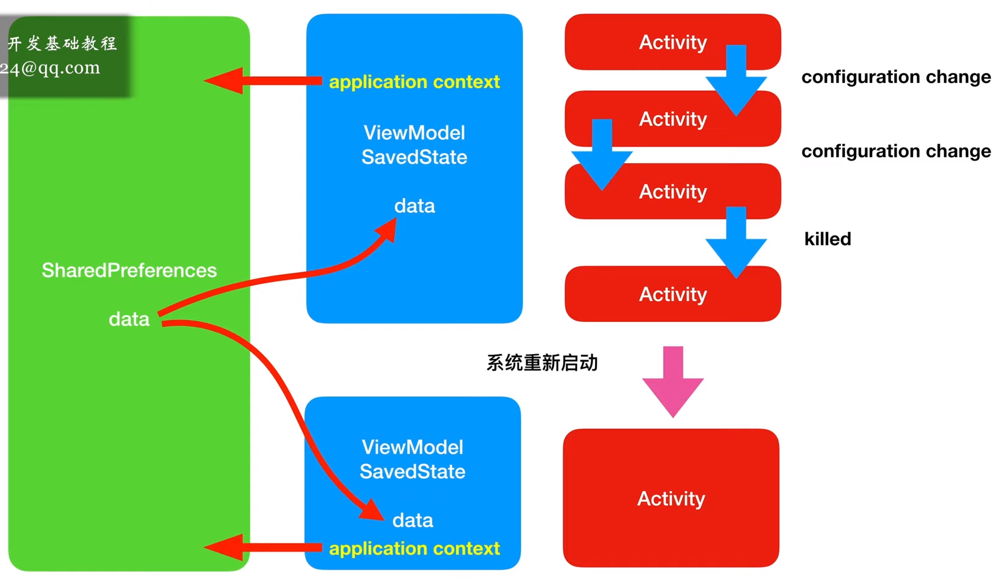
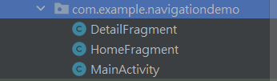
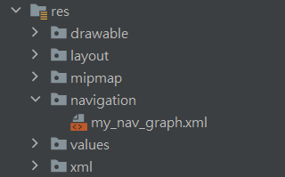

# Outline
- [Outline](#outline)
- [寫 Android 的好習慣，為自己而寫](#寫-android-的好習慣為自己而寫)
- [SharedPreference](#sharedpreference)
- [MVC](#mvc)
- [MVVM](#mvvm)
  - [ViewModel](#viewmodel)
  - [ViewModelWithLiveData](#viewmodelwithlivedata)
  - [DataBinding](#databinding)
  - [ViewModel SavedState](#viewmodel-savedstate)
  - [ViewModel with SharedPreference](#viewmodel-with-sharedpreference)
- [Navigation](#navigation)

# 寫 Android 的好習慣，為自己而寫
- 將常量放至 resource 裡，避免 hardcoded，讓可維護性上升，專案越大效果越顯著

# SharedPreference
**共用的資料，可以在外部和內部進行存取**
  1. getPreferences 方法，每個 Activity 只有一個

        ```java
        // MainActivity.java
        package com.example.sharedpreferences;

        import android.content.Context;
        import android.content.SharedPreferences;
        import android.os.Bundle;
        import android.util.Log;

        import androidx.appcompat.app.AppCompatActivity;

        public class MainActivity extends AppCompatActivity {

            @Override
            protected void onCreate(Bundle savedInstanceState) {
                super.onCreate(savedInstanceState);
                setContentView(R.layout.activity_main);

                SharedPreferences shp = getPreferences(Context.MODE_PRIVATE);
                SharedPreferences.Editor editor = shp.edit();
                // 寫入 NUMBER 為 100 的數字
                editor.putInt("NUMBER", 100);
                // 非同步提交，避免不同部件提早獲取時還未被寫入
                editor.apply();

                // 讀取 NUMBER，第一個是要讀取的變數名稱，第二個是如果沒有的默認返回值
                int x = shp.getInt("NUMBER", 0);
                String TAG = "MyLog";
                Log.d(TAG, "OnCreate: " + x);
            }
        }
        ```
        ```xml
        <!-- 在 Device File Explorer 裡的 data/data/package_name/shared_prefs 下會生成一個 MainActivity xml -->
        <?xml version='1.0' encoding='utf-8'standalone='yes' ?>
        <map>
            <int name="NUMBER" value="100" />
        </map>
        ```
  2. getSharedPreferences()，可以在一個 Activity 下創建多個
        ```java
        // MainActivity.java
        package com.example.sharedpreferences;

        import android.content.Context;
        import android.content.SharedPreferences;
        import android.os.Bundle;
        import android.util.Log;

        import androidx.appcompat.app.AppCompatActivity;

        public class MainActivity extends AppCompatActivity {

            @Override
            protected void onCreate(Bundle savedInstanceState) {
                super.onCreate(savedInstanceState);
                setContentView(R.layout.activity_main);

                // 只改這行
                SharedPreferences shp = getSharedPreferences("MY_DATA", Context.MODE_PRIVATE);
                SharedPreferences.Editor editor = shp.edit();
                // 寫入 NUMBER 為 100 的數字
                editor.putInt("NUMBER", 100);
                // 非同步提交，避免不同部件提早獲取時還未被寫入
                editor.apply();

                // 讀取 NUMBER，第一個是要讀取的變數名稱，第二個是如果沒有的默認返回值
                int x = shp.getInt("NUMBER", 0);
                String TAG = "MyLog";
                Log.d(TAG, "OnCreate: " + x);
            }
        }
        ```
        ```xml
        <!-- 在 Device File Explorer 裡的 data/data/package_name/shared_prefs 下會生成一個 MY_DATA xml -->
        <?xml version='1.0' encoding='utf-8' standalone='yes' ?>
        <map>
            <int name="NUMBER" value="100" />
        </map>
        ```
  3. 在 Activity 外部存取 SharedPreferences
        ```java
        // MainActivity.java
        package com.example.sharedpreferences;

        import android.os.Bundle;
        import android.util.Log;

        import androidx.appcompat.app.AppCompatActivity;

        public class MainActivity extends AppCompatActivity {

            @Override
            protected void onCreate(Bundle savedInstanceState) {
                super.onCreate(savedInstanceState);
                setContentView(R.layout.activity_main);

                // 不能傳遞 this，Activity 被殺掉時會導致 memory leak
                // 傳遞 getApplicationContext，因為它是單例
                MyData myData = new MyData(getApplicationContext());

                myData.number = 1000;
                myData.save();
                int y = myData.load();

                String TAG = "MyLog";
                Log.d(TAG, "onCreate: " + y);
            }
        }
        ```
        ```java
        // MyData.java
        package com.example.sharedpreferences;

        import android.content.Context;
        import android.content.SharedPreferences;

        public class MyData {

            public int number;
            private Context context;

            public MyData(Context context) {
                this.context = context;
            }
            public void save() {
                // in strings.xml，避免 hardCoded
                //     <string name="MY_DATA">my_data</string>
                String name = context.getResources().getString(R.string.MY_DATA);
                SharedPreferences shp = context.getSharedPreferences(name, Context.MODE_PRIVATE);
                SharedPreferences.Editor editor = shp.edit();
                // in strings.xml，避免 hardCoded
                //     <string name="MY_KEY">my_key</string>
                String key = context.getResources().getString(R.string.MY_KEY);
                editor.putInt(key, number);
                editor.apply();
            }

            public int load() {
                // in strings.xml，避免 hardCoded
                //     <string name="MY_DATA">my_data</string>
                String name = context.getResources().getString(R.string.MY_DATA);
                SharedPreferences shp = context.getSharedPreferences(name, Context.MODE_PRIVATE);
                // in strings.xml，避免 hardCoded
                //     <string name="MY_KEY">my_key</string>
                String key = context.getResources().getString(R.string.MY_KEY);
                // in int.xml(自己建的)，避免 hardCoded
                //     <integer name="defValue"> 0 </integer>
                int def_value = context.getResources().getInteger(R.integer.defValue);
                int x = shp.getInt(key, def_value);
                number = x;
                return x;
            }
        }
        ```
# MVC
**最一般的處理方式，為人垢病的就是要一直保存資料，避免 Activity 被短暫消滅後造成資料丟失**

```java
// MainActivity.java
package com.example.orientation;

import androidx.annotation.NonNull;
import androidx.appcompat.app.AppCompatActivity;

import android.os.Bundle;
import android.os.PersistableBundle;
import android.util.Log;
import android.view.View;
import android.widget.Button;
import android.widget.TextView;
import android.widget.Toast;

public class MainActivity extends AppCompatActivity {

    String TAG = "myLog";
    Button button2;
    TextView textView;

    @Override
    protected void onCreate(Bundle savedInstanceState) {
        super.onCreate(savedInstanceState);
        setContentView(R.layout.activity_main);
        textView = findViewById(R.id.textView);
        button2 = findViewById(R.id.button2);

        // onCreate 後馬上找尋是否有之前暫存的數據，有的話載入進來
        if(savedInstanceState != null) {
            String s = savedInstanceState.getString("KEY");
            textView.setText(s);
        }

        button2.setOnClickListener(new View.OnClickListener() {
            @Override
            public void onClick(View v) {
                textView.setText(R.string.button2);
            }
        });
    }

    // 為避免 Activity onDestroy 後數據丟失，要先保存在 SaveInstanceState
    @Override
    protected void onSaveInstanceState(@NonNull Bundle outState) {
        super.onSaveInstanceState(outState);
        outState.putString("KEY", textView.getText().toString());
    }

    @Override
    protected void onDestroy() {
        super.onDestroy();
        Log.d(TAG, "onDestroy: ");
    }
}
```
# MVVM
**使用了 MVVM 後，因為 Controller 不再管理資料，Activity 短暫被消滅(返回鍵、Portrait <-> Landscape、更改語言、關閉)時，再次重啟仍會保留資料**

## ViewModel

  1. 定義類繼承 ViewModel
   
        ```java
        package com.example.viewmodel;
        import androidx.lifecycle.ViewModel;
        public class MyViewModel extends ViewModel {
            public int number = 0;
        }
        ```
  2. 透過 ViewModel 來使用數據
        ```java
        package com.example.viewmodel;
        import androidx.appcompat.apAppCompatActivity;
        import androidx.lifecyclViewModelProvider;
        import android.os.Bundle;
        import android.view.View;
        import android.widget.Button;
        import android.widget.TextView;
        public class MainActivity extendAppCompatActivity {
            // 宣告 Object
            MyViewModel myViewModel;
            TextView textView;
            Button button1, button2;
            @Override
            protected void onCreate(Bundle savedInstanceState) {
                super.onCreate(savedInstanceState);
                setContentView(R.layout.activity_main);
                
                // 關聯 MyViewModel 類
                myViewModel = new ViewModelProvider(this).get(MyViewModel.class);
                textView = findViewById(R.id.textView);
                // 取得 myViewMode 裡的 number，這裡的 number 不再為 Controller 所持有，而是單獨存放在 myViewModel 的類中
                textView.setText(String.valueOf(myViewModel.number));
                button1 = findViewById(R.id.button);
                button2 = findViewById(R.id.button2);
                button1.setOnClickListener(new View.OnClickListener() {
                    @Override
                    public void onClick(View v) {
                        myViewModel.number++;
                        // 存取/寫入 myViewMode 裡的 number
                        textView.setText(String.valueOf(myViewModel.number));
                    }
                });
                button2.setOnClickListener(new View.OnClickListener() {
                    @Override
                    public void onClick(View v) {
                        // 存取/寫入 myViewMode 裡的 number
                        myViewModel.number += 2;
                        textView.setText(String.valueOf(myViewModel.number));
                    }
                });
            }
        }
        ```
## ViewModelWithLiveData

  1. 定義類繼承 ViewModel，使用 LiveData 儲存資料
   
        ```java
        // ViewModelWithLiveData.java
        package com.example.livedatatest;

        import androidx.lifecycle.MutableLiveData;
        import androidx.lifecycle.ViewModel;

        public class ViewModelWithLiveData extends ViewModel {
            // 要觀察的資料類型，並使用 MutableLiveData，因其具備可變性
            private MutableLiveData<Integer> LikedNumber;

            public MutableLiveData<Integer> getLikedNumber() {
                if(LikedNumber == null) {
                    LikedNumber = new MutableLiveData<>();
                    LikedNumber.setValue(0);
                }
                return LikedNumber;
            }

            public void addLikedNumber(int n) {
                LikedNumber.setValue(LikedNumber.getValue() + n);
            }
        }
        ```
  2. 關聯與註冊，比起沒用 LiveData 的 ViewModel，不用一直寫 textView.setText(...)

        ```java
        // MainActivity.java
        package com.example.livedatatest;

        import androidx.appcompat.app.AppCompatActivity;
        import androidx.lifecycle.Observer;
        import androidx.lifecycle.ViewModelProvider;

        import android.os.Bundle;
        import android.view.View;
        import android.widget.ImageButton;
        import android.widget.TextView;

        public class MainActivity extends AppCompatActivity {

            ViewModelWithLiveData viewModelWithLiveData;
            TextView textView;
            ImageButton imageButtonLike, imageButtonDislike;

            @Override
            protected void onCreate(Bundle savedInstanceState) {
                super.onCreate(savedInstanceState);
                setContentView(R.layout.activity_main);
                textView = findViewById(R.id.textView);
                imageButtonLike = findViewById(R.id.imageButton);
                imageButtonDislike = findViewById(R.id.imageButton2);

                viewModelWithLiveData = new ViewModelProvider(this).get(ViewModelWithLiveData.class);

                // 使用 observe 來註冊何時響應
                // 當 Android 覺得該 Activity 不再活躍時，有自動回收機制避免 memory leak，所以不用手動設置
                viewModelWithLiveData.getLikedNumber().observe(this, new Observer<Integer>() {
                    @Override
                    // 變動時進行響應
                    public void onChanged(Integer integer) {
                        textView.setText(String.valueOf(integer));
                    }
                });

                imageButtonLike.setOnClickListener(new View.OnClickListener() {
                    @Override
                    public void onClick(View v) {
                        viewModelWithLiveData.addLikedNumber(1);
                    }
                });

                imageButtonDislike.setOnClickListener(new View.OnClickListener() {
                    @Override
                    public void onClick(View v) {
                        viewModelWithLiveData.addLikedNumber(-1);
                    }
                });
            }
        }
        ```
## DataBinding

  1. 先進到 build.gradle(Module:app) 配置 dataBinding 為 true
        ```java
        // build.gradle(Module:app)
        android {
            namespace 'com.example.XXXXXXXXXX'
            compileSdk XX

            defaultConfig {
                applicationId "com.example.XXXXXXXXXX"
                minSdk XX
                targetSdk XX
                versionCode X
                versionName "X.X"

                testInstrumentationRunner "androidx.test.runner.AndroidJUnitRunner"

                // 添加此行
                dataBinding {
                    enabled true
                }
            }
        }
        ```
  2. 進到 layout 的 xml 文件中，點擊上面的燈泡，右鍵，轉換為 DataBinding style。將數據回綁到 xml file 中，就不需要在 MainActivity 裡進行綁定，減輕 Controller 的負載量
        ```java
        // activity_main.xml
        <?xml version="1.0" encoding="utf-8"?>
        <layout xmlns:android="http://schemas.android.com/apk/res/android"
            xmlns:app="http://schemas.android.com/apk/res-auto"
            xmlns:tools="http://schemas.android.com/tools">

        // 加入 data
            <data>
                <variable
                    name="data"
                    type="com.example.databinding.MyViewModel" />
            </data>

            <androidx.constraintlayout.widget.ConstraintLayout
                android:layout_width="match_parent"
                android:layout_height="match_parent"
                tools:context=".MainActivity">

                <TextView
                    android:id="@+id/textView"
                    android:layout_width="wrap_content"
                    android:layout_height="wrap_content"
                    // 反向 binding，即回綁
                    android:text="@{String.valueOf(data.number)}"
                    android:textSize="36sp"
                    app:layout_constraintBottom_toBottomOf="parent"
                    app:layout_constraintEnd_toEndOf="parent"
                    app:layout_constraintStart_toStartOf="parent"
                    app:layout_constraintTop_toTopOf="parent"
                    app:layout_constraintVertical_bias="0.325" />

                <Button
                    android:id="@+id/button"
                    android:layout_width="wrap_content"
                    android:layout_height="wrap_content"
                    android:text="Button"

                    // 反向 binding，即回綁
                    android:onClick="@{()->data.add()}"
                    app:layout_constraintBottom_toBottomOf="parent"
                    app:layout_constraintEnd_toEndOf="parent"
                    app:layout_constraintHorizontal_bias="0.5"
                    app:layout_constraintStart_toStartOf="parent"
                    app:layout_constraintTop_toTopOf="parent" />

            </androidx.constraintlayout.widget.ConstraintLayout>
        </layout>
        ```
  3. 定義類繼承 ViewModel
        ```java
        // MyViewModel.java
        package com.example.databinding;

        import androidx.lifecycle.MutableLiveData;
        import androidx.lifecycle.ViewModel;


        // 繼承 ViewModel
        public class MyViewModel extends ViewModel {
            private MutableLiveData<Integer> number;

            public MutableLiveData<Integer> getNumber() {
                if(number == null) {
                number = new MutableLiveData<>();
                number.setValue(0);
                }
                return number;
            }

            public void add() {
                number.setValue(number.getValue() + 1);
            }
        }

        ```
  4. 套用在 Activity java
        ```java
        // MainActivity.java
        package com.example.databinding;

            import android.os.Bundle;

            import androidx.appcompat.app.AppCompatActivity;
            import androidx.databinding.DataBindingUtil;
            import androidx.lifecycle.ViewModelProvider;

            import com.example.databinding.databinding.ActivityMainBinding;

            public class MainActivity extends AppCompatActivity {
                MyViewModel myViewModel;

                // 取決於 layout 名稱，為名稱+binding
                // (activity_main.xml 就是 ActivityMainBinding)
                ActivityMainBinding binding;

                @Override
                protected void onCreate(Bundle savedInstanceState) {
                    super.onCreate(savedInstanceState);
                    // Databinding 的綁定方式
                    binding = DataBindingUtil.setContentView(this, R.layout.activity_main);
                    // 關聯 myViewModel class
                    myViewModel = new ViewModelProvider(this).get(MyViewModel.class);
                    // 設置 layout 的 data
                    binding.setData(myViewModel);
                    // 一定要加，註冊綁定狀態
                    binding.setLifecycleOwner(this);
                }
            }
        ```

## ViewModel SavedState

**儘管 MVVM 使用 ViewModel 維持了 Activity 重啟時的數據存儲，但當 ViewModel 也被系統殺掉時(就是整個系統被殺掉，通常發生在記憶體不夠用或過久未使用時，系統自動會銷毀該應用程式)**


**要注意的是，如果是用戶手動殺掉，則 ViewModel SavedState 不會保留**

  1. 使用 onSavedInstanceState，跟一般的方法一樣(不建議)
        ```java
        // MyViewModel.java
        package com.example.viewmodelrestore;

        import androidx.lifecycle.MutableLiveData;
        import androidx.lifecycleSavedStateHandle;
        import androidx.lifecycle.ViewModel;

        public class MyViewModel extendsViewModel {
            private MutableLiveData<Integer> number;

            public MutableLiveData<Integer> getNumber() {
                if(number == null) {
                    number = new MutableLiveData<>();
                    number.setValue(0);
                }
                return number;
            }

            public void add() {
                number.setValue(number.getValue() + 1);
            }
        }
        ```
        ```java
        // MainActivity.java
        package com.example.viewmodelrestore;

        import androidx.annotation.NonNull;
        import androidx.appcompat.app.ppCompatActivity;
        import androidx.databinding.ataBindingUtil;
        import androidx.lifecycle.iewModelProvider;

        import android.os.Bundle;

        import com.example.viewmodelrestore.atabinding.ActivityMainBinding;

        public class MainActivity extends ppCompatActivity {
            MyViewModel myViewModel;
            ActivityMainBinding binding;
            final static String KEY_NUMBER = "my_number";

            @Override
            protected void onCreate(Bundle savedInstanceState) {
                super.onCreate(savedInstanceState);
                binding = DataBindingUtil.setContentView(this, R.layout.activity_main);
                myViewModel = new ViewModelProvider(this).get(MyViewModel.class);

                // 加載
                if(savedInstanceState != null) {
                    myViewModel.getNumber().setValue(savedInstanceState.getInt(KEY_NUMBER));
                }

                binding.setData(myViewModel);
                binding.setLifecycleOwner(this);
            }

            // 儲存
            @Override
            protected void onSaveInstanceState(@NonNull Bundle outState) {
                super.onSaveInstanceState(outState);
                outState.putInt(KEY_NUMBER, myViewModel.getNumber().getValue());
            }
        }
        ```
  2. ViewModel SavedState(建議)
        ```java
        // MyViewModel.java
        package com.example.viewmodelrestore;

        import androidx.lifecycle.MutableLiveData;
        import androidx.lifecycle.avedStateHandle;
        import androidx.lifecycle.ViewModel;

        public class MyViewModel extends iewModel {
            private SavedStateHandle handle;
            public MyViewModel(SavedStateHandle handle) {
                this.handle = handle;
            }
            public MutableLiveData<Integer> getNumber() {
                // 文檔所示，傳回來的 handle 不會為空
                // 這個情況只有在程式未被加載過，第一次加載時這個判斷才會成立
                if(!handle.contains(MainActivity.KEY_NUMBER)) {
                    // 初始化為 0
                    handle.set(MainActivity.KEY_NUMBER, 0);
                }
                return handle.getLiveData(MainActivity.KEY_NUMBER);
            }

            public void add() {
                getNumber().setValue(getNumber().getValue() + 1);
            }
        }
        ```
        ```java
        // MainActivity.java
        package com.example.viewmodelrestore;

        import androidx.appcompat.app.ppCompatActivity;
        import androidx.databinding.ataBindingUtil;
        import androidx.lifecycle.iewModelProvider;

        import android.os.Bundle;

        import com.example.viewmodelrestore.atabinding.ActivityMainBinding;

        public class MainActivity extends ppCompatActivity {
            MyViewModel myViewModel;
            ActivityMainBinding binding;
            public final static String KEY_NUMBER = "my_number";

            @Override
            protected void onCreate(Bundle savedInstanceState) {
                super.onCreate(savedInstanceState);
                binding = DataBindingUtil.setContentView(this, R.layout.activity_main);
                myViewModel = new ViewModelProvider(this).get(MyViewModel.class);
                binding.setData(myViewModel);
                binding.setLifecycleOwner(this);
            }
        }
        ```


## ViewModel with SharedPreference
請先查看上方的 [ViewModel](#viewmodel) 和 [SharedPreference](#sharedpreference)


```java
// MyViewModel.java
package com.example.viewmodelshp;

import android.app.Application;
import android.content.Context;
import android.content.SharedPreferences;
import androidx.annotation.NonNull;
import androidx.lifecycle.AndroidViewModel;
import androidx.lifecycle.LiveData;
import androidx.lifecycle.SavedStateHandle;
public class MyViewModel extends AndroidViewModel{
    SavedStateHandle handle;
    String key = getApplication().getResources().getString(R.string.key);
    String shp_name = getApplication().getResources().getString(R.string.shp_name);
    public MyViewModel(@NonNull Application application, SavedStateHandle handle) {
        super(application);
        this.handle = handle;
        if (!handle.contains(key)) {
            load();
        }
    }
    public LiveData<Integer> getNumber() {
        return handle.getLiveData(key);
    }
    void load() {
        SharedPreferences shp = getApplication().getSharedPreferences(shp_name, Context.MODE_PRIVATE);
        int x = shp.getInt(key, 0);
        handle.set(key, x);
    }
    void save() {
        SharedPreferences shp = getApplication().getSharedPreferences(shp_name, Context.MODE_PRIVATE);
        SharedPreferences.Editor editor = shp.edit();
        editor.putInt(key, getNumber().getValue() == null ? 0 : getNumber().getValue());
        editor.apply();
    }
    public void add(int x) {
        handle.set(key, getNumber().getValue() == null ? 0 : getNumber().getValue() + x);
    }
}
```
```java
// MainActivity.java
package com.example.viewmodelshp;

import androidx.appcompat.app.AppCompatActivity;
import androidx.databinding.DataBindingUtil;
import androidx.databinding.ViewDataBinding;
import androidx.lifecycle.avedStateViewModelFactory;
import androidx.lifecycle.ViewModelProvider;
import android.os.Bundle;
import com.example.viewmodelshp.databinding.ctivityMainBinding;
public class MainActivity extends ppCompatActivity {
    MyViewModel myViewModel;
    ActivityMainBinding binding;
    @Override
    protected void onCreate(Bundle savedInstanceState) {
        super.onCreate(savedInstanceState);
        setContentView(R.layout.activity_main);
        binding = DataBindingUtil.setContentView(this, R.layout.activity_main);
        myViewModel = new ViewModelProvider(this).get(MyViewModel.class);
        binding.setData(myViewModel);
        binding.setLifecycleOwner(this);
    }
    // onStop 不太可靠，如果是後台自動殺死，就不會呼叫到，同理 onDestroy 在 onStop 沒呼叫前也不會呼叫到
    // 如果程式閃退，死機、沒電、系統意外關機就不會被保存
    // 也可以放在 MyViewModel.java 的 add() 裡，但就是比較耗時，會一直觸發
    @Override
    protected void onPause() {
        super.onPause();
        myViewModel.save();
    }
}
```
```xml
<!-- activity_main.xml -->
<?xml version="1.0" encoding="utf-8"?>
<layout xmlns:android="http://schemas.android.com/apk/res/android"
    xmlns:app="http://schemas.android.com/apk/res-auto"
    xmlns:tools="http://schemas.android.com/tools">

    <data>

        <variable
            name="data"
            type="com.example.viewmodelshp.MyViewModel" />
    </data>

    <androidx.constraintlayout.widget.ConstraintLayout
        android:layout_width="match_parent"
        android:layout_height="match_parent"
        tools:context=".MainActivity">

        <TextView
            android:layout_width="wrap_content"
            android:layout_height="wrap_content"
            android:text="@{String.valueOf(data.getNumber())}"
            android:textSize="36sp"
            app:layout_constraintBottom_toBottomOf="parent"
            app:layout_constraintEnd_toEndOf="parent"
            app:layout_constraintStart_toStartOf="parent"
            app:layout_constraintTop_toTopOf="parent"
            app:layout_constraintVertical_bias="0.335" />

        <Button
            android:id="@+id/button"
            android:layout_width="wrap_content"
            android:layout_height="wrap_content"
            android:onClick="@{()->data.add(1)}"
            android:text="@string/button_plus"
            app:layout_constraintBottom_toBottomOf="parent"
            app:layout_constraintEnd_toEndOf="parent"
            app:layout_constraintHorizontal_bias="0.284"
            app:layout_constraintStart_toStartOf="parent"
            app:layout_constraintTop_toTopOf="parent"
            app:layout_constraintVertical_bias="0.499" />

        <Button
            android:id="@+id/button2"
            android:layout_width="wrap_content"
            android:layout_height="wrap_content"
            android:onClick="@{()->data.add(-1)}"
            android:text="@string/button_minus"
            app:layout_constraintBottom_toBottomOf="parent"
            app:layout_constraintEnd_toEndOf="parent"
            app:layout_constraintHorizontal_bias="0.712"
            app:layout_constraintStart_toStartOf="parent"
            app:layout_constraintTop_toTopOf="parent"
            app:layout_constraintVertical_bias="0.499" />

    </androidx.constraintlayout.widget.ConstraintLayout>
</layout>
```
# Navigation
17
- NavHost: 存放頁面，是一個容器同時也是一個控制器，用來承載 Fragment 並管理(使用 Stack)他們的導航
- Fragment: Activity 中模塊化的部分，可將頁面分為好幾塊，用來顯示頁面的其中小部分內容，依存於 Activity，Activity 先創建再建立 Fragment 附加上去
- NavController: 切換頁面的邏輯，需要定義一些切換的方法
- NavGraph: 使用圖形化的頁面來做切換頁面的邏輯，是 NavController 的圖形化實作方法

1. 在 build.gradle(app) 中最下方加入 dependencies

    ```gradle
    dependencies {
        constraints {
            implementation("org.jetbrains.kotlin:kotlin-stdlib-jdk7:1.8.0") {
                because("kotlin-stdlib-jdk7 is now a part of kotlin-stdlib")
            }
            implementation("org.jetbrains.kotlin:kotlin-stdlib-jdk8:1.8.0") {
                because("kotlin-stdlib-jdk8 is now a part of kotlin-stdlib")
            }
        }
    }
    ```
2. package 下右鍵 -> New -> Fragment，會產生相應的 layout 和 java file

    
3. res 下右鍵 -> New -> Android Resource File -> Type 選擇 Navigation

    
4. add a destination, placeholder 是還沒有建立 Fragment 時先用一個進行佔位，建立後可以使用右鍵選擇 Start，相連後箭頭指向可用來做頁面導向

    4.5. 右側的 Entry 和 End 可以設置切換時的動畫

5. 在主檔案建立 NavHostFragment，選擇剛剛建立好的 Navigation xml file(Step 3)
6. 編寫 java file
```java
// HomeFragment.java 下加入以下程式碼

// 繼承 onViewCreated，在這裡執行 View 建立好之後操作
@Override
public void onViewCreated(@NonNull View view,@Nullable Bundle savedInstanceState) {
    super.onViewCreated(view, savedInstanceState);
    // Step 4 裡箭頭有自己的 id，就是這裡的 R.id.xxx
    getView().findViewById(R.id.button).setOnClickListener(
            Navigation.createNavigateOnClickListener(
                    R.id.action_homeFragment_to_detailFragment)
    );
}
```
```java
// DetailFragment.java 下加入以下程式碼

// 繼承 onViewCreated，在這裡執行 View 建立好之後操作
@Override
public void onViewCreated(@NonNull View view,@Nullable Bundle savedInstanceState) {
    super.onViewCreated(view, savedInstanceState);
    // Step 4 裡箭頭有自己的 id，就是這裡的 R.id.xxx
    getView().findViewById(R.id.button2).setOnClickListener(
            Navigation.createNavigateOnClickListener(
                    R.id.action_detailFragment_to_homeFragment)
    );
}
```
```java
// MainActivity.java

package com.example.navigationdemo;

import android.os.Bundle;

import androidx.appcompat.app.AppCompatActivity;
import androidx.appcompat.widget.Toolbar;
import androidx.navigation.NavController;
import androidx.navigation.Navigation;
import androidx.navigation.fragment.NavHostFragment;
import androidx.navigation.ui.NavigationUI;

public class MainActivity extends AppCompatActivity {

    @Override
    protected void onCreate(Bundle savedInstanceState) {
        super.onCreate(savedInstanceState);
        setContentView(R.layout.activity_main);

        // 這裡的 id 要放的是 activity_main (放置 NavHostFragment 的 Activity) 裡
        // NavHostFragment 的 id
        NavHostFragment navHostFragment = (NavHostFragment) getSupportFragmentManager().
                findFragmentById(R.id.fragmentContainerView);
        NavController controller = navHostFragment.getNavController();
        // 沒有 toolbar 會錯誤，在 activity_main 建立一個簡易 toolbar
        Toolbar toolbar = findViewById(R.id.toolbar);
        setSupportActionBar(toolbar);
        NavigationUI.setupActionBarWithNavController(this, controller);
    }

    // 返回時的操作
    @Override
    public boolean onSupportNavigateUp() {
        // 原本的返回值不要
    //     return super.onSupportNavigateUp();
        NavController controller = Navigation.findNavController(this, R.id.fragmentContainerView);
        // 回傳返回操作，當點擊左上 Toolbar 的返回按鈕，則會回傳這個值，這個操作會將父節點的 stack 再次 push 
        return controller.navigateUp();
    }
}
```